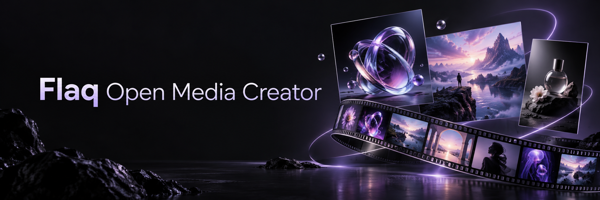
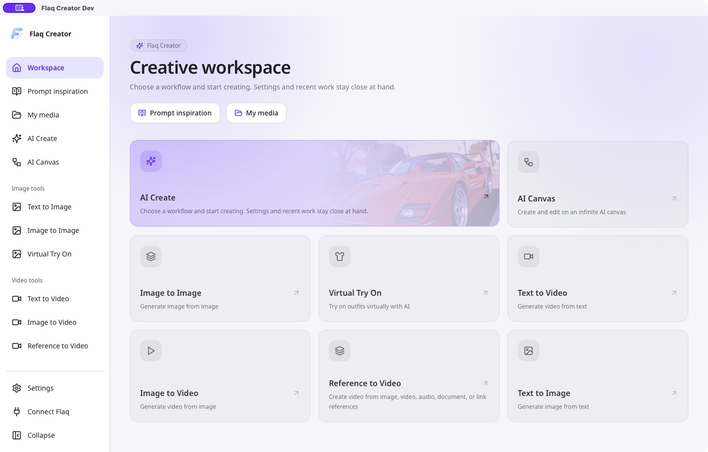
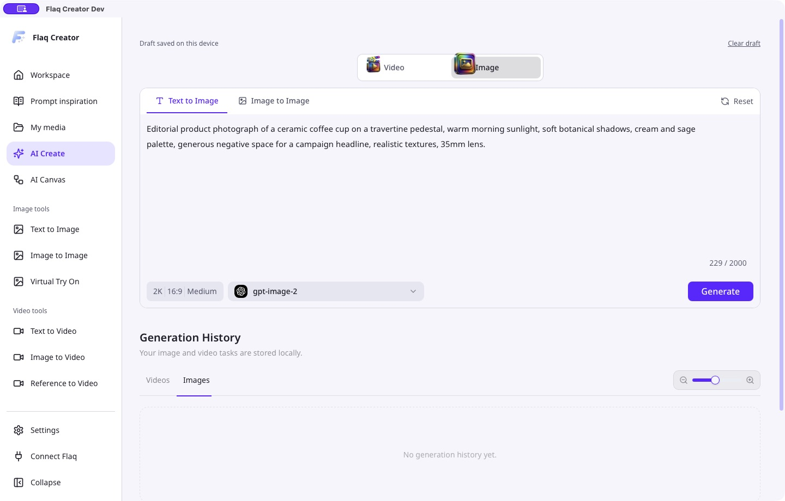
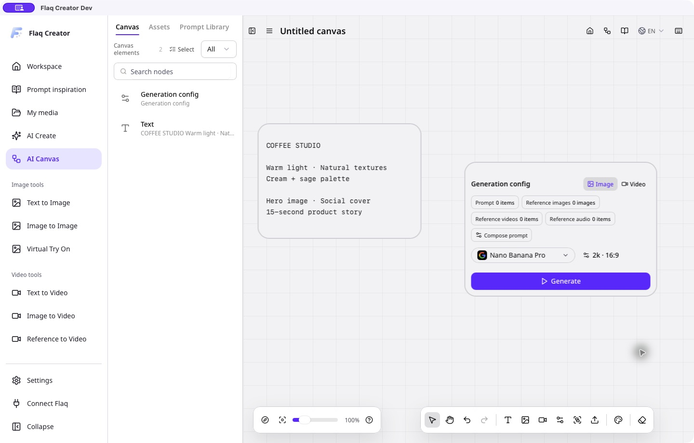
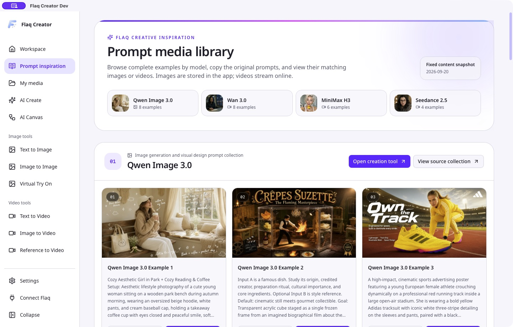

# Flaq Open Media Creator

크리에이터, 디자이너, 브랜드 팀을 위한 오픈 소스 **AI 이미지·동영상 제작 데스크톱 앱**입니다. 프롬프트 아이디어, 참조
미디어, 무한 캔버스를 한 공간에 모아 생성, 미리보기, 개선, 로컬 작품 정리를 진행할 수 있습니다.

[Flaq SaaS Template](https://github.com/flaqai/flaq-saas-template)을 기반으로 Tauri 2 + Rust 데스크톱 셸과 현대적인
React 인터페이스를 통해 Flaq AI 모델 서비스에 연결합니다. 설치된 앱의 이름은 **Flaq Creator**입니다.

**README:** [English](./README.md) · [日本語](./README_ja.md) · [Bahasa Indonesia](./README_id.md) ·
[Italiano](./README_it.md) · [Português (Brasil)](./README_pt.md) · [Español](./README_es.md) ·
[Deutsch](./README_de.md) · [Русский](./README_ru.md) · [Français](./README_fr.md) · [简体中文](./README_zh.md) ·
[繁體中文](./README_tw.md) · [한국어](./README_ko.md) · [ไทย](./README_th.md) · [Tiếng Việt](./README_vi.md) ·
[العربية](./README_ar.md)

## 데스크톱 앱 스크린샷: 작업 공간, AI 창작, 무한 캔버스

실행 중인 macOS 데스크톱 앱의 영어 화면입니다. 창작 패널은 로컬 데모 초안을, 프롬프트 라이브러리는 기본 제공 예제 이미지를 보여 줍니다.

### 창작 작업 공간 — 도구, 프롬프트 영감, 미디어 바로가기



### AI 이미지 창작 — 프롬프트, 모델, 생성 설정



### 무한 캔버스 — 창작 기획과 생성 노드 배치



### 프롬프트 영감 — 시각 예제와 재사용 가능한 프롬프트 탐색



## Flaq AI 모델 플랫폼과 온라인 창작 도구

[Flaq AI](https://flaq.ai/ko/)는 크리에이터, 개발자, 기업을 위해 이미지 생성·편집, 동영상 생성, 언어 작업의 주요 AI
모델을 모은 플랫폼입니다.

- **높은 동시 처리 성능과 안정적인 API** — 통합 API로 제품과 제작 과정에 AI 생성을 연결합니다.
- **온라인에서 바로 창작** — 코드를 작성하거나 앱을 설치하지 않고 브라우저의 [Flaq AI](https://flaq.ai/ko/)에서 모델과
  도구를 사용합니다.
- **탐색과 통합** — [모델 마켓](https://flaq.ai/ko/model-market/)에서 비교하고 [API 문서](https://flaq.ai/ko/docs/)로
  연동을 시작합니다.

비즈니스 문의: [contact@flaq.ai](mailto:contact@flaq.ai)

## AI 데스크톱 기능: 아이디어를 이미지와 동영상으로

### AI 이미지 생성, 동영상 제작, 가상 착용

8개 진입점이 일상적인 창작을 지원합니다. 통합 작업 공간에서 아이디어를 탐색하거나 전용 도구로 제품 이미지, 소셜 콘텐츠,
광고 콘셉트, 짧은 영상을 제작하세요.

| 창작 도구         | 가능한 작업                                                    | 경로                  |
| ----------------- | -------------------------------------------------------------- | --------------------- |
| AI Media Creator  | 한 공간에서 이미지·영상을 만들고 결과를 확인하며 아이디어 개선 | `/ai-media-creator`   |
| AI 무한 캔버스    | 텍스트, 미디어, 생성 설정을 저장 가능한 로컬 프로젝트에 정리   | `/ai-canvas`          |
| 텍스트에서 이미지 | 프롬프트로 표지, 포스터, 제품 장면의 스타일 탐색               | `/text-to-image`      |
| 이미지에서 이미지 | 참조 이미지로 새로운 스타일과 시각적 방향 개발                 | `/image-to-image`     |
| 가상 착용         | 의류와 모델 참조를 결합해 패션·상거래 콘셉트 구상              | `/virtual-try-on`     |
| 텍스트에서 동영상 | 글로 쓴 아이디어를 움직이는 장면과 캠페인 콘셉트로 변환        | `/text-to-video`      |
| 이미지에서 동영상 | 정지 이미지로 움직이는 제품 비주얼과 클립 제작                 | `/image-to-video`     |
| 참조에서 동영상   | 참조 미디어로 동영상 제작 방향 유도                            | `/reference-to-video` |

경로에서 언어 접두사는 생략했습니다. 도구는 [기능 레지스트리](./lib/features/catalog.ts)를 공유합니다. 입력, 제한,
매개변수는 선택 모델과 [모델 계약](./lib/constants/template-models/)에 따라 다릅니다.

### 프롬프트 라이브러리와 무한 캔버스로 아이디어 탐색

- **예시로 시작**: 라이브러리를 탐색하고 전체 프롬프트를 복사하며 이미지·영상 미리보기를 확대하거나 이동합니다. 예시
  이미지는 포함되어 있고 영상은 온라인 재생됩니다. 컬렉션의 모델 이름이 생성 양식에서 해당 모델을 지원한다는 뜻은
  아닙니다.
- **프로젝트를 시각적으로 정리**: 캔버스에 텍스트, 미디어, 설정을 배치합니다. 이동·확대·축소와 노드 작업을 사용하고 로컬
  프로젝트로 저장해 나중에 이어갑니다.
- **작업에 맞는 모델 선택**: 상황별 도움말을 보며 지원 매개변수를 조정합니다. 첫 실행 안내와 연결 테스트로 설정하고
  외관·언어를 일상 사용에 맞춥니다.

### 로컬 미디어 라이브러리, 초안 복구, 작품 내보내기

- **참조와 작품 찾기**: 업로드한 참조와 생성 결과를 유형·출처로 검색하고 미리보기, 다운로드, 로컬 보관 상태를
  확인합니다. `/media-library` 또는 설정 → 기록에서 엽니다.
- **창작 진행 상황 유지**: 초안의 프롬프트, 매개변수, 미디어를 로컬에 저장하며 작업 기록과 참조 인덱스도 기기에
  남습니다. 대기 작업 복구는 원래 작업을 조회하며 새 유료 생성을 제출하지 않습니다.
- **완성 결과 보관**: 지정 폴더의 `YYYY/MM/DD` 아래에 이미지·영상을 저장해 편집과 납품에 활용합니다. 보관 복구는 기존
  결과 저장만 재시도합니다.
- **다음 제작 단계 준비**: 기본 저장 대화상자, PNG/JPEG/WebP 내보내기, 필요할 때 로드되는 FFmpeg WASM 자르기를
  사용합니다.

### 크리에이터를 위한 실용적인 작업 흐름

1. 프롬프트 예시를 살펴보거나 캔버스에 텍스트와 참조를 정리합니다.
2. 도구와 모델을 고르고 프롬프트, 참조, 지원 매개변수를 설정합니다.
3. 제출하고 결과를 확인해 다음 생성을 개선합니다.
4. 라이브러리에서 결과를 찾아 보관·내보낸 파일을 후속 제작에 사용합니다.

생성에는 인터넷, 유효한 Flaq AI Client Key, 충분한 크레딧이 필요합니다. 모델은 클라우드에서 실행되며 로컬 초안,
프로젝트, 인덱스는 기기 간 클라우드 동기화를 제공하지 않습니다.

## 시작하기: 데스크톱 앱 실행과 Flaq AI 연결

### 필수 환경

- [.nvmrc](./.nvmrc)에 맞는 Node.js **22**.
- [package.json](./package.json)의 `packageManager`에 맞는 pnpm **10.5.2**.
- 네이티브 개발·패키징용 Rust와 대상 OS의 [Tauri 필수 구성 요소](https://v2.tauri.app/start/prerequisites/).
  프런트엔드만 빌드할 때는 Rust가 필요하지 않습니다.
- 실제 생성용 Flaq AI 계정과 Client Key. 기본 업로드에는 별도 Cloudflare 계정이 **필요하지 않습니다**.

저장소 루트에서 실행:

```bash
pnpm install --frozen-lockfile
pnpm desktop:dev
```

개발판은 `ai.flaq.creator.dev`, 설치판은 `ai.flaq.creator`를 사용합니다. 설정, WebView 데이터, 기본 미디어 폴더가
분리됩니다.

### Flaq AI 연결

1. [Flaq AI](https://flaq.ai/ko/)에 로그인해 Client Key를 받습니다.
2. 첫 실행 안내를 따르거나 설정 → 연결을 엽니다.
3. 기본 Base URL `https://api.flaq.ai` 또는 호환되는 신뢰할 수 있는 게이트웨이를 사용합니다.
4. 키를 입력하고 연결을 테스트한 뒤 저장합니다.
5. 기본 업로드 제공자를 유지하거나 자체 R2 프리셋을 명시적으로 설정합니다.
6. 도구·모델을 선택하고 프롬프트/참조를 입력해 제출합니다. 설정 → 기록에서 결과를 관리하고 설정 → 일반에서 보관 폴더를
   변경합니다.

> **자격 증명 저장:** “기억하기”는 현재 사용자의 앱 설정 폴더에 있는 `auth.json`에 읽을 수 있는 JSON을 저장합니다. **OS
> 키체인이나 앱 수준 암호화가 아닙니다.** Unix 권한은 현재 사용자로 제한되며 세션 전용 자격 증명은 이 네이티브 파일에
> 저장되지 않습니다. 공유 기기에서는 기억하기를 피하고 키, 비밀이 포함된 로그, 로컬 설정을 커밋하지 마세요.

### 미디어 업로드와 로컬 데이터 저장

| 대상        | 현재 구현                                                                                                                                                |
| ----------- | -------------------------------------------------------------------------------------------------------------------------------------------------------- |
| 기본 업로드 | Client Key로 `/api/v1/files/presignedUrl`에서 단기 서명 URL을 받아 직접 업로드합니다. 공유 R2 자격 증명은 서버에 남으며 패키지에 포함되지 않습니다.      |
| 자체 R2     | 계정 ID, 버킷, 접근 키, 비밀 키, 공개 도메인을 선택적으로 설정합니다. 로컬 서명과 WebView AES-GCM 프리셋 저장을 사용하며 OS 자격 증명 저장소가 아닙니다. |
| 입력 초안   | IndexedDB가 바이트와 메타데이터를 저장합니다. 파일 선택 시에는 업로드하지 않고 제출 시 업로드합니다.                                                     |
| 기록과 목록 | 로컬 Web Storage가 작업과 업로드 참조를 인덱싱합니다. 목록 항목은 소유권이나 클라우드 삭제 권한이 아닙니다.                                              |
| 생성 파일   | 지정 미디어 루트로 네이티브 스트리밍 저장하며 기본값은 앱 데이터 폴더입니다. 보관 실패가 완료된 생성을 실패로 바꾸지 않습니다.                           |

자체 R2에는 S3 엔드포인트만이 아닌 공개 접근 가능한 미디어 도메인이 필요합니다. 보존 기간은 Flaq 정책 또는 버킷 수명
주기에 따르며 로컬 보관과 독립적입니다. 브라우저 측 프리셋 암호화는 손상된 WebView나 앱 프로필·코드에 접근 가능한
공격자를 막지 못합니다. 신뢰할 수 있는 게이트웨이와 업로드 대상을 사용하세요.

### 선택적인 Web 모드

서버를 실행하는 원래 Next.js Web 모드도 유지됩니다:

```bash
pnpm dev
pnpm build
pnpm start
```

`http://localhost:3000`을 엽니다. Web 환경을 설정할 경우 편집기에서 [.env.example](./.env.example)을 `.env.local`로
복사해 필요한 값만 입력합니다.

| 변수                                                                          | 용도                                  |
| ----------------------------------------------------------------------------- | ------------------------------------- |
| `NEXT_PUBLIC_SITE_URL`, `NEXT_PUBLIC_CONTACT_US_EMAIL`                        | 공개 사이트 URL과 연락처              |
| `R2_ACCOUNT_ID`, `R2_ACCESS_KEY_ID`, `R2_SECRET_ACCESS_KEY`, `R2_BUCKET_NAME` | Web 업로드 서명용 서버 전용 자격 증명 |

Web 업로드는 `app/api/upload/presigned-url/route.ts`와 이미지 호스팅의 공개 도메인을 사용합니다. 데스크톱 기본 경로는
Flaq 서명을 사용하므로 로컬 R2 환경 변수나 Next.js API 서버가 필요하지 않습니다. 비밀에 `NEXT_PUBLIC_`를 붙이거나 설치
파일에 포함하지 마세요.

## 데스크톱 아키텍처: Tauri 2, Rust, Next.js

**Tauri 2 + Rust가 정적으로 내보낸 Next.js UI를 제공하며 Node.js/Next.js 서버를 포함하지 않습니다.** 데스크톱과 Web은
React 페이지, 양식, 모델 계약, 번역, 디자인 리소스를 공유합니다.

### 일상 창작을 위한 현대적인 기술

- **네이티브 셸과 정적 UI**: Tauri 2는 시스템 WebView를 사용하고 Rust는 창, 설정, 파일 저장을 처리합니다. 로컬 Node.js
  서버가 필요하지 않습니다.
- **타입과 입력 검증**: TypeScript, 공유 계약, Zod가 양식과 API 요청을 일치시켜 매개변수 오류를 줄이고 모델 통합을 쉽게
  합니다.
- **비동기 작업과 필요 시 로딩**: 중앙 폴링과 업로드 동시성 제한으로 작업을 조율합니다. FFmpeg와 자체 R2 서명은 필요할
  때만 로드해 시작 시 불필요한 작업을 줄입니다.
- **안정적인 저장**: Rust가 임시 파일로 다운로드한 뒤 완성된 파일을 게시해 중단 시 불완전한 결과가 남을 위험을 줄입니다.
  생성·보관 상태를 분리해 복구합니다.

### 파일 개인정보 보호: 로컬 저장과 업로드 제어

명확한 데이터 흐름과 접근 검사로 창작 자료를 보호합니다:

- **초안은 먼저 로컬에**: IndexedDB가 미디어와 메타데이터를 저장합니다. 파일 선택만으로 업로드하지 않으며 생성 제출 시
  시작합니다.
- **단기 업로드 권한**: 기본 제공자는 Client Key로 서명 URL을 받습니다. 공유 R2 자격 증명은 서비스에 남고 앱에 포함되지
  않습니다.
- **캔버스 파일별 접근**: 네이티브 코드가 실제 경로를 확인하고 허용된 출력 폴더의 보관 미디어인지 검사한 뒤 해당 파일의
  미리보기를 허용합니다.
- **설정 분리**: 개발판과 설치판은 별도 ID와 WebView 데이터를 사용합니다. Unix에서는 현재 사용자만 저장된 연결 파일을
  읽고 쓸 수 있습니다.

**개인정보 보호 범위:** 로컬 저장은 완전한 오프라인 처리나 파일 암호화를 뜻하지 않습니다. 생성 시 관련 프롬프트·참조가
설정된 서비스로 전송되며 원격 보존은 서비스 또는 버킷 정책에 따릅니다. 기억된 Client Key는 OS 키체인이 아닌 읽을 수 있는
JSON입니다. 위의 “미디어 업로드와 로컬 데이터 저장”을 참고하세요.

### 기술 스택과 소스 구조

| 계층           | 구현과 역할                                                                      |
| -------------- | -------------------------------------------------------------------------------- |
| UI             | Next.js 16, React 19, TypeScript, Tailwind CSS 4, Radix UI, Framer Motion        |
| 양식과 상태    | React Hook Form + Zod; Zustand; 일부 SWR                                         |
| 기능/모델 계약 | 8개 도구의 공통 레지스트리, 입력·제한·기본값 공유                                |
| 서비스         | Flaq 어댑터, 업로드 정책, 중앙 폴링, 생성/보관 수명 주기                         |
| 플랫폼 경계    | 네이티브/Web HTTP, 내보내기/저장, 외부 링크; UI에서 네이티브 명령 직접 호출 금지 |
| 네이티브 셸    | Tauri 2 / Rust: 설정, 권한, 창, 로그, 스트리밍과 원자적 저장                     |
| 현지화         | next-intl, 등록된 15개 언어, 아랍어 RTL                                          |
| 검증           | Node/tsx 회귀, Rust 테스트, Playwright 레이아웃, ESLint, TypeScript              |

```text
app/[locale]/       현지화된 도구, 라이브러리, 홈, 정책 페이지
app/api/            Web 전용 업로드 서명과 이미지 프록시
components/         공통 UI, 데스크톱 셸, 양식, 대화상자, 미디어/프롬프트 뷰어
hooks/              UI 통합과 재사용 훅
lib/features/       기능 레지스트리
lib/constants/template-models/  모델 계약
lib/desktop/        연결 설정, 초안, 목록, 미디어 환경설정
lib/platform/       네이티브/Web 어댑터
lib/recommended-prompts*        선정 프롬프트 정의와 콘텐츠 스냅샷
network/            API 클라이언트, 업로드, 폴링, 기록, 수명 주기
store/              공유 Zustand 상태
i18n/ + messages/   언어 등록, 라우팅, 번역
src-tauri/          Rust 셸, 권한, 패키징 설정
scripts/            분리 빌드, 미디어 준비, 콘텐츠 동기화, 출시 도구
tests/              계약, 저장, 복구, 빌드/출시, UI 회귀
public/             앱 리소스와 포함된 프롬프트 이미지
docs/               아키텍처, 모듈 안내, 검토 기록, README 배너
```

데스크톱 빌드는 독립 작업 폴더에서 Web 전용 경로를 제외하고 성공 시에만 `out/`을 교체합니다. 소스 경로는 이동하거나
삭제하지 않습니다. 네이티브 HTTP가 API/업로드/다운로드를 처리하므로 브라우저 CORS 제약에 의존하지 않습니다. 자체 R2 AWS
서명과 자르기용 로컬 FFmpeg는 지연 로딩됩니다. 업로드 동시성을 제한하고 공유 미디어 처리는 직렬화하며 폴링을 중앙
관리합니다.

새 모듈은 레지스트리와 계약을 확장하고 API 로직을 `network/`에 두며 `lib/platform/`을 재사용하고 번역·회귀 테스트를
추가합니다. 참고:

- [아키텍처와 저장 경계](./docs/DESKTOP_ARCHITECTURE.md)
- [모듈 추가와 로컬 QA](./docs/ADDING_MODULES.md)
- [도메인 용어](./CONTEXT.md)
- [제품 목록](./docs/PRODUCT_INVENTORY.md)과 [검토 보고서](./docs/REVIEW_REPORT.md): 특정 시점 기록이며 현재 출시판
  검증을 보증하지 않습니다.

## 데스크톱 앱 빌드, 테스트, 패키징

| 명령                                              | 목적                                                       |
| ------------------------------------------------- | ---------------------------------------------------------- |
| `pnpm desktop:dev`                                | 미디어 준비, 개발 UI와 네이티브 앱 시작                    |
| `pnpm build:desktop`                              | 모든 등록 언어의 정적 프런트엔드를 `out/`으로 생성         |
| `pnpm desktop:build`                              | 현재 OS용 프런트엔드와 네이티브 패키지 빌드                |
| `pnpm check`                                      | TypeScript + Node 회귀 + ESLint                            |
| `pnpm test:ui-layout`                             | Playwright 레이아웃 테스트; Google Chrome과 포트 3000 필요 |
| `cargo test --manifest-path src-tauri/Cargo.toml` | Rust 네이티브 테스트; 대상 플랫폼 빌드 의존성 필요         |
| `pnpm prompts:sync`                               | 유지관리: 네트워크에서 선정 프롬프트/리소스 갱신           |

로컬 모의 생성은 `pnpm build:desktop` 후 `node scripts/desktop-preview.mjs`를 실행합니다. `http://127.0.0.1:4173/zh/`를
열고 Base URL을 `http://127.0.0.1:4173`으로, 키를 `test-only-key`로 설정하고 기억하지 않습니다. 모의 API는 실제 Flaq
생성, R2 업로드, 네이티브 동작을 검증하지 않습니다. 실제 키를 사용하지 마세요.

### 패키징 지원 상태

저장소의 [출시 워크플로](./.github/workflows/desktop-build.yml)는 다음 대상을 정의합니다:

| 대상                | 산출물                                      |
| ------------------- | ------------------------------------------- |
| macOS Apple Silicon | `.dmg`와 `.app` ZIP                         |
| macOS Intel         | `.dmg`와 `.app` ZIP                         |
| Windows x64         | NSIS `.exe` 설치 파일; MSI 없음             |
| Linux               | 소스 빌드 대상; 현재 출시 매트릭스에서 제외 |

수동 실행은 후보 패키지를 만들며 일치하는 `desktop-v<version>` 태그가 출시를 시작합니다. 결과에는 `SHA256SUMS`와
`release-manifest.json`이 포함됩니다. 현재 패키지는 서명되지 않았으며 공개 배포에는 플랫폼별 서명/공증과 네이티브 시작
검증이 필요합니다. 워크플로 정의가 모든 플랫폼의 빌드·테스트 성공을 뜻하지 않습니다.

## 언어 지원과 인터페이스 현지화 (i18n)

언어 등록과 README 번역: `en`, `ja`, `id`, `it`, `pt`, `es`, `de`, `ru`, `fr`, `zh`, `tw`, `ko`, `th`, `vi`, `ar`.

- 데스크톱 경로는 `/en/`을 포함해 항상 언어를 표시합니다. 시작 시 저장 언어, 시스템 언어, 영어 순으로 선택합니다. 번체
  중국어 변형은 `tw`에 연결됩니다.
- Web은 영어에 `/`, 다른 언어에 접두사를 사용합니다. 아랍어는 RTL입니다.
- **현재 제한:** 일부 신규 설정·미디어·프롬프트 라이브러리 텍스트는 중국어와 영어로 직접 작성되어 있습니다. `zh`/`tw`는
  중국어를 공유하고 다른 언어는 해당 패널에서 영어로 표시됩니다. 15개 언어 등록은 모든 새 문구의 번역 완료를 의미하지
  않습니다.
- 언어 추가 시 [i18n/languages.ts](./i18n/languages.ts), `messages/`, 라우팅/빌드, README, 일치성 테스트를 갱신합니다.

## Flaq AI 팀: AI 엔지니어링과 창작 흐름

[Flaq AI](https://flaq.ai/ko/)는 싱가포르에 등록된 **FLAQ AI PTE. LTD.**가 운영합니다. 제품 디자인, 모델·API 엔지니어링,
창작 과정 경험을 결합해 크리에이터, 개발자, 기업이 AI를 이해하고 비교하며 활용하도록 돕습니다.

모델과 도구 경험, API 통합, 이미지·영상·오디오·언어 모델의 실용적인 응용을 통해 아이디어를 실제 제작 과정으로
연결합니다.

자세히 보기: [Flaq AI 팀과 회사](https://flaq.ai/about/). 비즈니스 문의: [contact@flaq.ai](mailto:contact@flaq.ai).

## Flaq AI 제휴 프로그램: 창작 도구를 공유하고 보상 받기

AI 이미지·영상 작업 흐름, 모델 API, 창작 도구를 소개하고 수수료를 받을 수 있습니다. 크리에이터, 디자이너, 개발자, AI
교육자, 모델 리뷰어, 실용적인 활용법을 공유하는 팀을 환영합니다.

- **추천 보상** — 추천 사용자의 첫 유효 유료 주문에 20%, 가입 후 60일 이내 후속 유효 주문에 10%를 지급하며 자격·귀속
  규칙이 적용됩니다.
- **유연한 홍보** — 튜토리얼, 모델 리뷰, 작품 사례, 커뮤니티, API 통합 안내에서 전용 링크를 공유합니다.
- **파트너 작업 공간** — Flaq AI에서 추천 링크, 활동, 지급 설정을 관리합니다.

로그인 후 제휴 프로필과 계약을 완료하고 링크를 만드세요. 프로젝트에도 현지화된 홍보 진입점이 있지만 가입과 수수료 관리는
데스크톱 앱이 아닌 Flaq AI에서 이루어집니다.

**[Flaq AI 제휴 프로그램 참여 →](https://flaq.ai/ko/affiliate-program/)**

> 수수료 자격, 귀속, 환불, 지급 심사, 승인된 개별 파트너 계약은 공식 페이지의 최신 조건을 따릅니다.

## 라이선스

이 프로젝트는 [MIT 라이선스](LICENSE)의 오픈 소스입니다.
