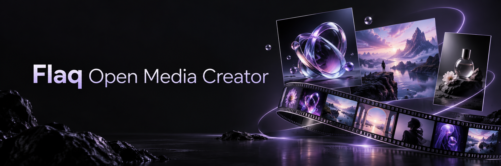

# Flaq Open Media Creator (Русский)

Открытое настольное рабочее пространство для создания изображений и видео с ИИ на базе Flaq SaaS Template. Установленное
приложение по-прежнему называется Flaq Creator.

**README:** [English](./README.md) · [日本語](./README_ja.md) · [Bahasa Indonesia](./README_id.md) ·
[Italiano](./README_it.md) · [Português (Brasil)](./README_pt.md) · [Español](./README_es.md) ·
[Deutsch](./README_de.md) · [Русский](./README_ru.md) · [Français](./README_fr.md) · [简体中文](./README_zh.md) ·
[繁體中文](./README_tw.md) · [한국어](./README_ko.md) · [ไทย](./README_th.md) · [Tiếng Việt](./README_vi.md) ·
[العربية](./README_ar.md)

## О Flaq AI

[Flaq AI](https://flaq.ai/ru/) — платформа ИИ для авторов контента, разработчиков и бизнеса, объединяющая ведущие
популярные модели для создания и редактирования изображений, генерации видео и работы с языком.

- **API с высокой параллельностью и стабильностью** — Встраивайте генерацию ИИ в продукты и производственные процессы
  через единый API.
- **Работа прямо онлайн** — Используйте модели и творческие инструменты [Flaq AI](https://flaq.ai/ru/) в браузере без
  написания кода и установки настольного приложения.
- **Выбор моделей и интеграция** — Сравнивайте возможности в [каталоге моделей](https://flaq.ai/ru/model-market/) и
  начинайте интеграцию с [документацией API](https://flaq.ai/ru/docs/).

Деловые запросы: [contact@flaq.ai](mailto:contact@flaq.ai)

## Текущая реализация

Tauri 2 и Rust загружают статический интерфейс Next.js 16 и React 19 без встроенного сервера Node.js/Next.js. Формы,
контракты моделей и оформление общие с веб-версией.

Семь входов: AI Media Creator, текст в изображение, изображение в изображение, виртуальная примерка, текст в видео,
изображение в видео и референсы в видео. Есть библиотека промптов, поиск по каталогу медиа, история в настройках,
черновики IndexedDB и локальный архив по датам. Примеры изображений включены в приложение, видео воспроизводятся онлайн.
Успех генерации и архивирования учитывается отдельно.

## Быстрый старт

Выполните команды в корне этого репозитория. Нужны Node.js 22, pnpm 10.5.2, Rust и зависимости Tauri для вашей ОС. В
Настройки → Подключение введите Client Key Flaq AI, проверьте соединение и сохраните. Base URL по умолчанию:
`https://api.flaq.ai`. Реальная генерация требует интернета и средств API.

```bash
pnpm install --frozen-lockfile
pnpm desktop:dev
```

- `pnpm build:desktop` → `out/`
- `pnpm desktop:build` → Tauri
- `pnpm check` → TypeScript + tests + ESLint
- Web: `pnpm dev`; `pnpm build` + `pnpm start`

[Tauri prerequisites](https://v2.tauri.app/start/prerequisites/) ·
[README: setup / architecture / tests](./README.md#getting-started) ·
[模块扩展 / Adding modules](./docs/ADDING_MODULES.md)

## Загрузка и учётные данные

По умолчанию временные подписанные URL выдаёт Flaq `/api/v1/files/presignedUrl`. Общие ключи R2 остаются на сервере;
свой аккаунт Cloudflare не нужен. Собственный R2 подключается по желанию, подпись создаётся локально. Пресеты AES-GCM в
WebView — не системное хранилище секретов. При запоминании Client Key сохраняется открытым текстом в `auth.json`
каталога конфигурации приложения.

## Платформы и языки

Матрица выпуска включает macOS Apple Silicon/Intel (DMG, ZIP) и Windows x64 (NSIS EXE). Linux можно собрать из
исходников, но в матрицу выпуска он не входит. Текущие пакеты не подписаны. Зарегистрировано 15 локалей, однако часть
новых панелей настроек, медиа и промптов доступна только на китайском/английском: `zh`/`tw` используют общий китайский
текст, остальные — английский. Настольные маршруты всегда имеют префикс, включая `/en/`; веб-английский использует `/`,
остальные — префиксы. Арабский использует RTL.

`en`, `ja`, `id`, `it`, `pt`, `es`, `de`, `ru`, `fr`, `zh`, `tw`, `ko`, `th`, `vi`, `ar`

## Партнёрская программа Flaq AI

Станьте партнёром Flaq AI и получайте комиссию за рекомендации инструментов для работы с изображениями и видео, API
моделей и творческих процессов с ИИ. Программа открыта для авторов контента, дизайнеров, разработчиков, преподавателей
ИИ, обозревателей моделей и команд, делящихся практическими сценариями.

- **Вознаграждение за рекомендации** — Получайте 20% с первого действительного оплаченного заказа привлечённого
  пользователя и 10% с последующих действительных оплаченных заказов в течение 60 дней после его регистрации, согласно
  правилам участия и атрибуции.
- **Гибкое продвижение** — Делитесь своей ссылкой в уроках, обзорах моделей, примерах работ, сообществах и руководствах
  по интеграции API.
- **Кабинет партнёра** — Управляйте ссылками, отслеживайте переходы и действия привлечённых пользователей, настраивайте
  выплаты на Flaq AI.

Войдите в Flaq AI, заполните партнёрский профиль и примите соглашение, затем создайте свою ссылку. Проект также содержит
локализованные приглашения в программу; регистрация партнёров и управление комиссиями выполняются на Flaq AI, а не в
настольном приложении.

**[Присоединиться к партнёрской программе Flaq AI →](https://flaq.ai/ru/affiliate-program/)**

> Право на комиссию, атрибуция, возвраты, проверка выплат и одобренные индивидуальные условия определяются актуальными
> правилами на официальной странице программы.

## Документация и лицензия

Полная настройка, стек технологий и развёртывание описаны в [README.md](./README.md) и [README_zh.md](./README_zh.md).
Проект распространяется по [MIT License](LICENSE).
